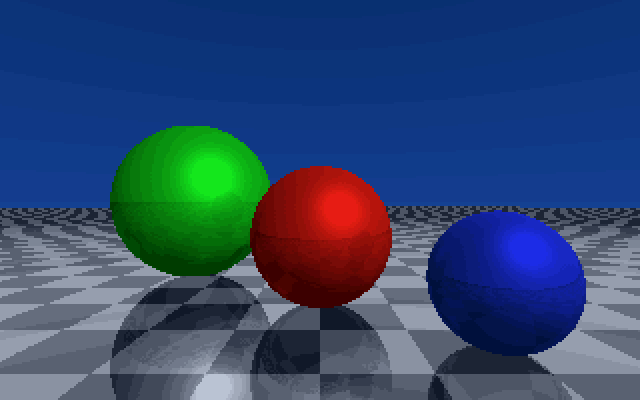
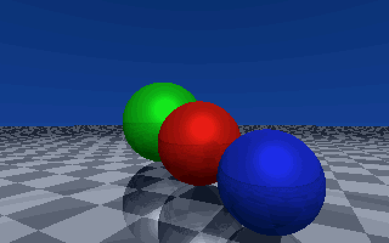
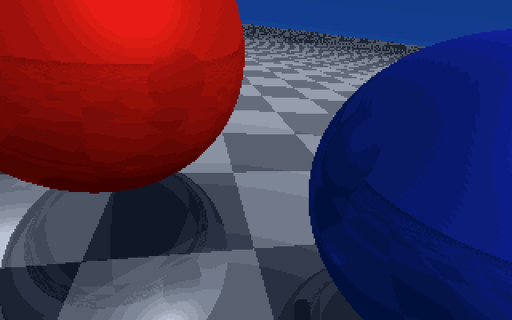
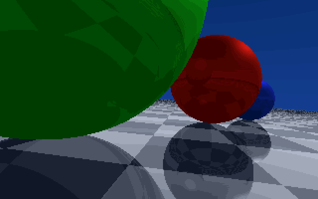
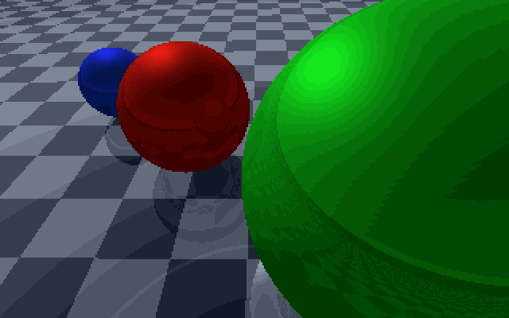
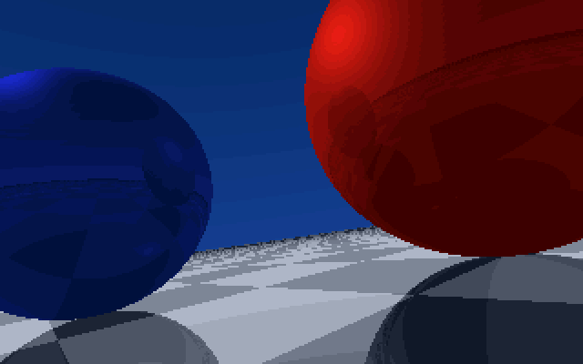
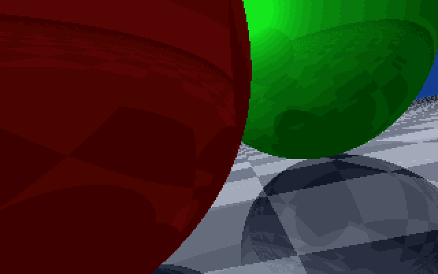

# Real-Time Ray Tracer for MS-DOS

A real-time interactive ray tracer for MS-DOS that runs on 386+ PCs with FPU. Experience real-time ray tracing on hardware from the 1990s with reflections, shadows, and specular highlights.

## Overview

This is a pure software ray tracer written in C for MS-DOS that implements:
- **Real-time camera movement** (WASD + mouse look controls)
- **Mirror reflections** with fading based on distance
- **Shadow mapping** with soft shadows
- **Specular highlights** using Blinn-Phong shading
- **Dynamic quality settings** for different performance levels
- **Checkerboard mirror floor** with environmental reflections

## Features

- **Interactive 6DOF Camera**: Move freely through the 3D scene
- **Adaptive Rendering**: Switch between draft (4x4 blocks) and full quality
- **Full Lighting Model**: Ambient + diffuse + specular components
- **Mirror Reflections**: On both spheres and floor surfaces
- **VGA 256-Color Palette**: Custom gradient palettes for realistic shading
- **Real-Time Performance**: Up to 2 FPS on Pentium III at draft quality

## Technical Details

- **Platform**: MS-DOS, 386+ CPU with FPU (387/487)
- **Graphics**: VGA Mode 0x13 (320x200, 256 colors)
- **Compiler**: Turbo C++ 3.0 or compatible
- **Memory**: Uses far pointers for VRAM access
- **Math**: Full floating-point operations with optimizations

## Building

```bash
# Using Turbo C/C++ 3.0
tcc ray.c
```

## Controls

| Key | Action |
|-----|--------|
| **W/S** | Move forward/backward |
| **A/D** | Strafe left/right |
| **Q/E** | Move up/down |
| **Arrow Keys** | Look around (rotate camera) |
| **1** | Draft quality (fastest) |
| **2** | Medium quality |
| **3** | Full quality (slowest) |
| **+/-** | Adjust movement speed |
| **ESC** | Exit |

## Gallery









### DOSBox (Recommended)
1. Mount a directory containing the EXE
2. Set CPU cycles appropriately (start with 30000, adjust)
3. Run: `ray.exe`
